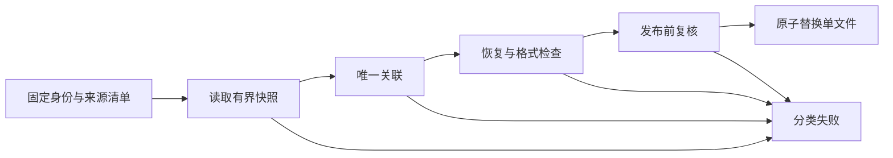

# 账号隔离、确定定位与原子发布

本页是通用设计建议；具体项目落实程度见[当前实现](../implementation/architecture.md)。

## 把身份放进数据流

账号是处理上下文，不应依赖最近修改目录、UI上一次选择或全局可变变量。消息引用携带账号、会话、来源分片和记录身份。底层rowid只在所属数据库有效。发现文件是候选，验证关联后才得到可以发布的证据。

## 失败不能折叠为空结果

至少区分缺失、歧义、schema不支持、材料缺失、认证失败、资源超限、源变化和依赖不可用。业务层可用类型化结果表达这些状态，界面再转换为易懂说明。错误不携带正文、秘密或私人路径。

读取预算从外层请求传递到SQL、解压、子进程和输出。解压只读到limit+1能区分正好达到上限与超限；取消或超时之后还需清理已派发工作。重试使用稳定幂等身份，不能因提交响应丢失而重复执行。

## 验证与发布分离

先完成解码和关联，再写最终产物。临时文件放在可原子替换的同一目标文件系统，使用私有权限；发布前复核源与目标，失败保留旧结果。加密认证、媒体头检查和播放器验证各有不同保证，不能用后者掩盖前者缺失。

多文件导出使用显式清单记录完成范围。单文件原子性不自动提供多文件事务；跨进程并发还需要领域锁或更强协调。测试使用完全合成的账号、数据库和媒体结构，分别注入歧义、截断、源变更和并发目标替换。
