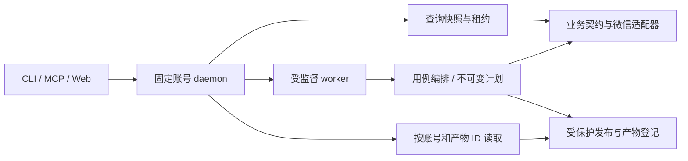
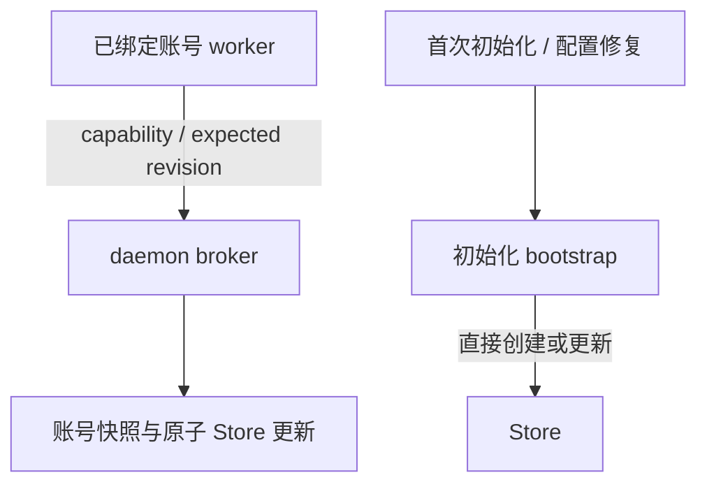

# 当前实现与执行边界

证据：C；本页以固定代码提交 `b7015ad2b7060a5dff6ddb9a9e2cc3a88403e86e` 为依据。阅读范围为 CLI 注册、模块声明、worker 材料、初始化、计划与产物、Windows 进程创建，以及私有快照、目录固定、读取预算和 Web 展示的相关符号；未变化部分复用前轮核对，哈希及边界见[版本证据](../evidence/versions.md)。源码可证实不等于本任务已运行生产测试，也不描述微信自身的内部架构。

## 入口与职责

CLI、MCP 和本地 Web 适配输入输出。daemon 按固定账号装配查询快照、前台操作、持久任务与 worker 生命周期；查询、前台租约与持久队列有不同的执行及取消语义。微信适配器解释 SQLite 字段、记录关联及媒体格式，业务契约表达可复用的对象和规则。

CLI 使用 `wx chats`、`wx moments`、`wx media`、`wx keys`、`wx database`、`wx emoticons` 等功能分组，以及 `wx setup`、`wx cleanup`、`wx web`、`wx voices`、`wx tasks` 等入口。`wx toolkit` 不受支持；固定版本的解析测试明确拒绝该命令，源码也没有 `src/cli/toolkit.rs` 或 `src/daemon/operations/toolkit.rs`。命令示例不能从历史工具箱路径推导。

图表示职责关系，不表示所有调用必经全部节点或所有工作都在同一进程。

| 路径 | 职责 |
|---|---|
| `src/cli/`、`src/web/`、`src/mcp/` | 命令、HTTP 与 JSON-RPC 入口 |
| `src/service/` | 类型化请求、通信、计划引用及产物契约 |
| `src/daemon/` | 账号快照、任务、worker 监督、密钥 broker 和产物交付 |
| `src/application/` | 聊天归档、计划与增量、数据库导出、朋友圈、图片发布、监控及清理 |
| `src/business/` | 业务模型和窄接口 |
| `src/adapters/wechat/` | SQLite 字段、记录关联及微信私有格式 |
| `src/infrastructure/` | 文件发布、输出树、配置、SQLite 验证、清理及取消 |
| `src/windows_process/`、`src/private_file.rs` | 受控 Windows 进程和私有文件保护 |

固定版本提供同步 `wx voices`、持久任务 `export_voices` 的原始 SILK 导出，以及只读语音目录；不提供 WAV/MP3 转码或 ASR。`src/infrastructure/audio`、转录基础设施和应用转录模块不属于该版本目录。数据库认证、DAT、表情 CBC、SNS 密钥流与外部音频解码也不能概括为同一种媒体解密算法。详见[语音](../wechat/voice.md)。

## 材料与初始化

`src/daemon/worker_keys.rs` 负责 broker 授权、快照读取及更新，`src/service/worker_keys.rs` 提供访问载体与客户端。授权绑定账号运行上下文、配置、daemon 父身份、子进程 PID、活跃进程句柄、capability 和 revision。载体通过受监督 worker 的私有输入交付；账号材料只取已验证的 32 字节值。身份、权限、代际或进程状态不符时拒绝；输出脱敏，临时材料清零。

worker 携带预期 revision 请求更新，由 daemon 原子保存 Store 并处理同请求幂等。账号捕获的账号与逐库材料在一次更新中提交；外部替换 Store 不承诺自动热重载。

已绑定正式运行上下文时，saved/memory 经 broker 获取初始化种子并提交逐库材料，account 提交账号及逐库材料。首次初始化或配置修复无法绑定正式上下文时，`src/daemon/operations/init.rs` 直接创建或更新 Store，只允许显式 memory/account，saved 拒绝。材料和配置分别原子发布，不是跨文件事务。

## 计划与受控产物

`chat_plan`、`chat_plan_review`、`chat_plan_apply` 使用现有 daemon 任务服务。计划引用绑定任务、产物 ID 和 SHA-256；审阅生成新版本，只修改选择标记，不原地改写旧计划，也不产生审批状态。执行校验固定账号、配置、内容与选集，发布到新的任务目录。

原始语音任务与同步CLI共享选择和严格关联，任务将SILK/证据作为完整组登记到新任务根。产物登记与文件落盘是不同状态；只有验证通过的登记产物可读取，不能通过任意路径浏览磁盘。计划、读取授权、取消窗口和计数限制见[计划与产物](plans-and-artifacts.md)。这不是所有 CLI 导出能力已在 MCP/Web 对等开放的声明。

## 私有数据库快照与有界读取

聊天媒体及计划由 `daemon::operations::media_snapshot::prepare_snapshot` 准备私有解密数据库，再通过 `ResourceSnapshot` 逐库执行 SQLite Backup，把已提交数据（包括解密副本 WAL 中已提交的数据）复制到静态副本，仅对副本设置 `journal_mode=DELETE`。静态文件移到批次私有根下的单层路径，逻辑 source 不变；计划消费者继续检查路径位于根内且只有一个层级。原始语音 CLI 与任务统一使用 `prepare_voice_snapshot`，由 `VoiceSnapshot` 持有各静态副本，覆盖整个读取生命周期。

这不是跨库原子快照。冷解密和 Backup 可能耗时；源清单或状态变化会拒绝处理，等待写入稳定后重试。不删除源 WAL/SHM/journal，也不修改源库日志模式；严格语音读取器仍拒绝侧车。不能据此保证微信持续写入时成功或任意版本兼容。

运行目录及祖先由 `service::transport::DirectoryGuard` 使用属性与列目录权限固定，禁止共享删除而允许子文件创建。计划大小扫描先读属性，对目录取得列举句柄并复核身份；扫描不读取文件正文。目录固定不表示子内容被冻结，缺权限或身份变化明确失败。

配置及 ConfigPin 的读取上限为4 MiB，进程身份记录为16 KiB；图片输入通过已固定句柄读取，DAT 上限64 MiB，预检大小并保留有界读取与前后复核。不同接口还有各自的输出/响应预算，不能把这些数值视为全局统一限额。

## 创建时 Job 归属

受控进程使用 Windows 10+ 的 `PROC_THREAD_ATTRIBUTE_JOB_LIST`，在 `CreateProcessW` 时绑定 kill-on-close Job，并以挂起状态创建，再恢复执行。生产路径不回退为创建后再绑定；系统不支持或宿主 Job 不兼容时明确失败。

`HANDLE_LIST` 只传递标准输入输出的临时副本，Job 句柄不继承。worker 的私有请求是有界 stdin 帧，不进入 argv 或环境变量。普通 Job 不允许 breakaway；只有明确授权的账号捕获保留让用户应用继续运行的专用例外，worker 本身仍受监督。

取消、超时和正常退出均需回收受管后代；停止等待不证明进程已终止。强制终止不执行 Rust 析构，可能遗留暂存文件；Job 归属不提供多文件事务、磁盘配额或自动续跑。此处是固定源码边界，本任务未执行进程测试或真实微信实验。

## 图片材料与离线发布

宿主通过 `wx keys import-image --stdin` 输入至多4096字节的严格JSON图片材料；CLI将材料封装为当前用户DPAPI密文，worker验证固定账号和实际V2样本，再经daemon broker按预期revision执行CAS更新，保留其他材料。`--no-save`仅验证。普通解码不接收明文AES覆盖，MCP/Web不开放该宿主导入入口；无Runtime的明文离线旁路不受支持。XOR格式字节及独立视频恢复材料不因此取消。

离线SNS仍接受显式数据库、联系人和缓存来源，但固定Runtime/ConfigPin、实际文件及已有/缺失SQLite侧车。有缓存时逐个验证真实V2候选与受保护图片材料；无缓存也在最终发布前核验来源及配置，且不读取图片材料。fresh在目录rename前复核，update逐文件persist前复核；已经提交的前缀不回滚，不构成跨文件或跨对象原子CAS。

目录Pin使用 `FILE_READ_ATTRIBUTES | FILE_LIST_DIRECTORY`（access `0x81`）及读写共享（share `3`），禁止删除共享；祖先目录同样固定。允许子文件创建与原子替换，不表示目录内容被冻结。普通源文件保持只读共享（share `1`），另行核验文件身份。缺少列目录权限的路径明确拒绝，无attributes-only降级；专门no-list ACL场景尚未实测。

## Web 展示与查询契约

Web 联系人读取当前账号 `SqliteContacts` 的独立 `nickname`、`remark` 字段，界面优先显示昵称；CLI/MCP contacts 仍使用 Names 快照的 username/display 投影。账号栏显示从绑定账号联系人资料取得的昵称和微信号，资料不可用时明确显示未读取，不把运行实例哈希当昵称。这是已选账号的展示，不是自动确认当前登录微信或自动切换账号。

Web 会话列表按最近消息时间降序排列；这不改变消息历史分页顺序。HTTP `/api/favorites` 与 MCP `get_favorites` 提供收藏查询；`link`/`file` 类型筛选都对应宽泛应用消息类型49，不能据此精确区分链接和文件。
