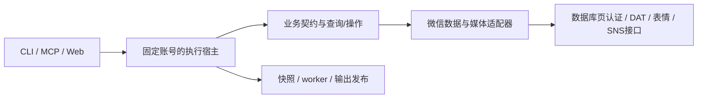
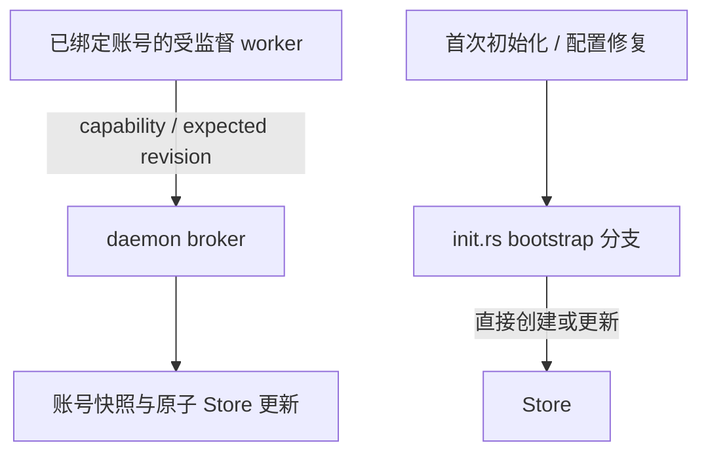

# 当前实现与执行边界

证据：C；2026-09-17先复核`f6f3ba9479f693b8dad73586a0b284016fd3d1b3`，再映射至Private源码基线`b9fcd4c9a5de5f3290502235af36bc4a404bf1f9`；两者间生产机制源码未变，变化为文档与测试断言。哈希与阅读范围见[版本](../evidence/versions.md)。本页不等于整仓运行验收，也不描述微信自身架构。

## 当前实现

CLI、MCP和本地Web负责各自输入输出。业务执行以账号为隔离单位，由daemon装配查询快照、任务和worker生命周期；不是所有工作都在单一线程或持久任务队列。微信适配器负责SQLite字段、媒体格式及关联，业务契约表达联系人、消息和媒体结果。

数据库、图片、表情和SNS拥有不同的材料与算法，不能抽成“同一个媒体解密器”。DAT是纯字节恢复；SNS运行时不下载或选择账号；表情下载器调用纯CBC恢复后继续转换与发布。宿主负责授权、路径、预算和输出。

此图是本次原创的职责概览，不表示所有调用都沿单一线性路径。`src/toolkit`已物理删除；仍存在的`src/cli/toolkit.rs`与`src/daemon/operations/toolkit.rs`是正式`wx toolkit`命令分组和执行分发，不是旧Toolkit架构层。

## 当前职责目录

| 路径 | 职责 |
|---|---|
| `src/application/` | 聊天归档、增量导出、数据库导出、朋友圈、转录、监控等用例编排 |
| `src/business/` | 业务模型和窄接口 |
| `src/adapters/wechat/` | 微信SQLite字段、记录关联与私有媒体格式 |
| `src/infrastructure/` | 发布、输出树、SQLite验证、音频、转录后端、取消及配置事务 |
| `src/web/` | HTTP、SSE和静态资源入口 |
| `src/daemon/` | 固定账号查询状态、任务、worker监督及密钥broker |
| `src/service/` | 协议、操作请求与worker访问载体 |
| `src/windows_process/`、`src/private_file.rs` | 受控Windows进程及私有文件保护 |

## worker与初始化材料边界

`src/daemon/worker_keys.rs`负责broker授权、快照读取与更新，`src/service/worker_keys.rs`提供访问载体及客户端。授权绑定账号运行上下文、配置、daemon父身份、子进程PID和活跃进程句柄、capability及revision；访问载体通过受监督worker的私有输入交付。账号、数据库、图片材料按权限读取或预装；账号材料只取`verified_account_key()`结果并校验32字节。错误身份、权限、过期代际或进程退出均拒绝，输出脱敏、临时材料清零。

worker提交expected revision，由daemon原子更新Store并处理同请求幂等；account捕获的Account与Databases在一次更新中提交。worker不自行选择持久化格式，外部替换Store不承诺自动热重载。

已绑定正式运行上下文时，saved/memory经broker取得初始化种子并提交数据库材料，account经broker提交账号与数据库材料。首次初始化或配置修复无法绑定正式上下文时，`src/daemon/operations/init.rs`仍直接创建/更新Store，只允许显式memory/account，saved拒绝。不能称全部初始化已经broker化，也不能把daemon目录名理解成所有操作都在同一进程内。

2026-09-16所述“src/toolkit仍存在”“worker尚未统一”及目标结构图已过时，本版替换为当前职责和例外图。所有图源均在本文，无外链资产。本轮仅做源码定向阅读与文档检查，未执行生产Rust构建、进程测试或真实账号实验；其他任务的测试报告不自动成为本任务的独立验收。Private发布、Public转换、npm及二进制发布仍分别管理。
